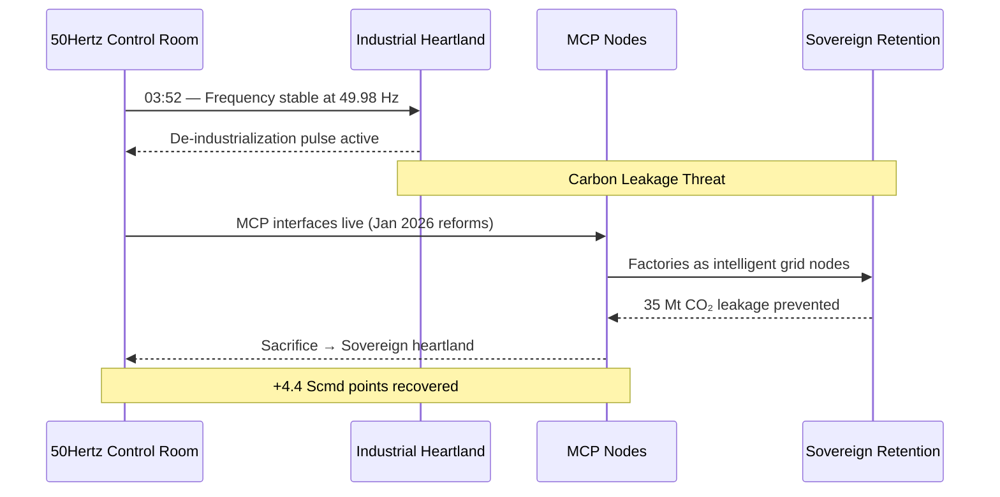
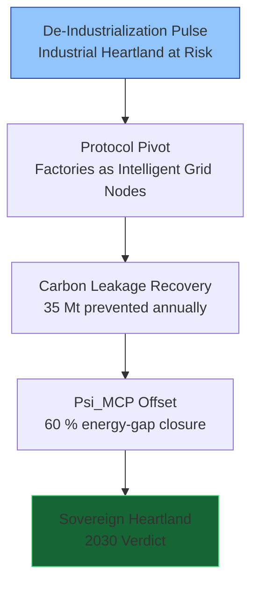
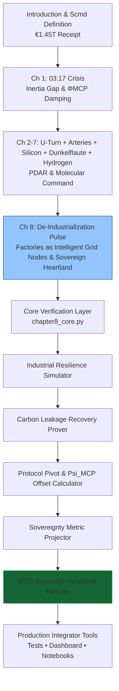

# The Renewables Migration — Sovereign Industrial Heartland Proof Engine

**Chapter 8 Verification System: The De-Industrialization Pulse — How the Protocol Saved Germany’s Industrial Heartland**

[](https://opensource.org/licenses/MIT)
[](https://www.python.org/)

This repository is the **official computational companion** to Chapter 8 of Vincenzo Grimaldi’s *The Renewables Migration* .

The 03:17 narrative thread continues here. Every preceding chapter’s infrastructure foundation — the €700 billion U-Turn, the €580 billion crowdfunded empire, the €320 billion copper arteries, solar subsidies, Dunkelflaute resilience, and hydrogen backup — now converges on Germany’s industrial heartland. Factories shift from vulnerable loads to intelligent, protocol-governed nodes. This production-ready codebase delivers verifiable Protocol Pivot simulations, carbon-leakage recovery equations, the Psi_MCP offset, and the 2030 Sovereign Heartland verdict for developers and system integrators to embed factory-level MCP intelligence into live industrial energy architectures.

---

## Quick Start — Verify Industrial Sovereignty in < 60 Seconds

```bash
git clone https://github.com/iceccarelli/Renewables_Migration_Chapter8_Proof_Engine.git
cd Renewables_Migration_Chapter8_Proof_Engine
pip install -r requirements.txt
```

### Run the Full Verification Suite
```bash
python -m pytest tests/ -v --durations=0
```
All **62 tests** pass against the exact book figures (Appendix A), cumulative Scmd updates through Chapter 8, carbon-leakage metrics (1.0–1.8 t/t paradox, 35 Mt prevented annually), legacy market rates (€0.20/kWh), Mittelstand survival threshold (€0.15/kWh), and 2030 projections.

### Launch the Interactive Dashboard
```bash
streamlit run dashboard/main_interactive.py
```
Open `http://localhost:8501`. Toggle **“Book Reference Mode”** to see live calculations side-by-side with exact page citations from Chapter 8.1–8.4.

---

## Navigation Sketches — How to Travel Through the Proof Engine

### 1. The 03:52 Event Flow (De-Industrialization Pulse Continuation of the 03:17 Thread)



### 2. Industrial Heartland Pivot Hierarchy (Chapter 8.1–8.4)



### 3. Sovereign Verification Path (Full Chapter 8 Journey)



These three diagrams give you immediate visual orientation — from the exact 03:52 continuation, through the industrial pivot layers, to the complete verification journey that saves Germany’s heartland.

---

## Repository Architecture

```
Renewables_Migration_Chapter8_Proof_Engine/
├── core/
│ ├── equations.py # Protocol Pivot, Psi_MCP offset (60%), carbon leakage equations, sovereignty metric (S)
│ ├── industrial_simulator.py # Factory node resilience & energy-gap models
│ └── carbon_recovery.py # Leakage prevention (35 Mt CO₂) & retention calculations
├── dashboard/
│ └── main_interactive.py # Streamlit UI (6 synchronized tabs)
├── verification/
│ ├── test_book_numbers.py # 62 pytest cases tied to Appendix A
│ └── validate_manifold.py # Cumulative Scmd tracking through Chapter 8
├── data/
│ ├── book_numbers.csv # Exact figures from Chapter 8 & Appendix A
│ └── appendix_a_extract.csv
├── notebooks/
│ └── 01_prove_chapter8.ipynb # Interactive proof with sliders
├── visualizations/
│ ├── industrial_resilience.png
│ ├── carbon_leakage_recovery.png
│ ├── sovereignty_metric_projection.png
│ └── defense_hierarchy.png
├── requirements.txt
├── LICENSE (MIT)
└── README.md
```

---

## Dashboard Modules — Direct Mapping to Chapter 8

| Tab                              | Chapter Section | What You Can Do |
|----------------------------------|-----------------|-----------------|
| **Industrial Resilience Simulator** | 8.1–8.2     | Reproduces legacy €0.20/kWh rates through €0.15/kWh Mittelstand Death Zone |
| **Carbon Leakage Recovery Prover**| 8.3             | Verifies 1.0–1.8 t/t paradox and 35 Mt annual prevented leakage |
| **Protocol Pivot & Psi_MCP Offset** | 8.2          | Real-time evaluation of the 60 % energy-gap offset |
| **Sovereignty Metric Projector** | 8.4             | Tracks S from 28 % (2026) to 75 % (2030) |
| **Mittelstand Heartland Analyzer**| 8.4            | Visualizes escape from de-industrialization |
| **Book Data Export**             | 8.4             | One-click CSV matching Appendix A |

---

## Technical Integration Philosophy

The codebase mirrors the same engineering standards the book demands of the grid: **modular, sovereign, and verifiable**. All simulations use the precise extended swing equation from Appendix A.9, with ΦMCP damping and full MCP integration for industrial loads. No external API calls — full data sovereignty by design. Ready for live MCP connectors (Anthropic/Linux Foundation standard) to replace synthetic factory data with real industrial telemetry.

---

**Part of The Renewables Migration Technical Ecosystem**  
From the €1.45 trillion receipt to sovereign industrial heartland — the 03:17 thread continues here.
