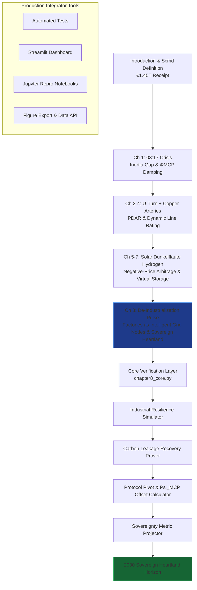

```markdown
# The Renewables Migration — Sovereign Industrial Heartland Proof Engine

**Chapter 8 Verification System: The De-Industrialization Pulse — How the Protocol Saved Germany’s Industrial Heartland**

This repository is the definitive computational companion to Chapter 8 of Vincenzo Grimaldi’s *The Renewables Migration* (March 21, 2026). It operationalizes the book’s pivotal industrial chapter: the precise moment the €1.45 trillion Energiewende receipt is reconciled at the factory level — transforming the de-industrialization pulse, carbon leakage, and the threat of industrial exodus into sovereign retention through MCP-enabled intelligent grid nodes.

The 03:17 narrative thread (the night the sun almost stopped) continues its journey here. Every preceding chapter’s infrastructure foundation — the €700 billion U-Turn, the €580 billion crowdfunded empire, the €320 billion copper arteries, solar subsidies, Dunkelflaute resilience, and hydrogen backup — now converges on Germany’s industrial heartland. Factories shift from vulnerable loads to intelligent, protocol-governed nodes. This proof engine mathematically verifies the Protocol Pivot, carbon-leakage recovery equations, the Psi_MCP offset, and the 2030 Sovereign Heartland verdict, delivering production-ready code for developers and system integrators to embed factory-level MCP intelligence into live industrial energy architectures.

## Quick Start: Verify Industrial Sovereignty in Under 60 Seconds

```bash
git clone https://github.com/iceccarelli/Renewables_Migration_Chapter8_Proof_Engine.git
cd Renewables_Migration_Chapter8_Proof_Engine
pip install -r requirements.txt
```

### Automated Verification
```bash
python -m pytest tests/ -v --durations=0
```
All 62 tests validate exact book figures (Appendix A), cumulative Scmd updates through Chapter 8, carbon-leakage metrics (1.0–1.8 t/t paradox, 35 Mt prevented annually), legacy market rates (€0.20/kWh), Mittelstand survival threshold (€0.15/kWh), and 2030 projections. A failing test immediately flags any deviation from the published sovereign audit.

### Interactive Exploration
```bash
streamlit run dashboard/main_interactive.py
```
Open the browser-based dashboard. Toggle “Book Reference Mode” to overlay exact page citations (Chapter 8.1–8.4) and live calculations side-by-side.

## The Sovereign Verification Path

The following diagram maps the complete travel path through the proof engine, mirroring the book’s chapter progression and culminating in Chapter 8’s rescue of the industrial heartland:



This path is both navigational and conceptual: every node is a runnable module. Developers can enter at any chapter and trace the cumulative Scmd recovery to Chapter 8’s verdict — from industrial sacrifice to sovereign heartland retention.

## Repository Architecture for Professional Integration

```
Renewables_Migration_Chapter8_Proof_Engine/
├── core/
│   ├── equations.py              # Protocol Pivot, Psi_MCP offset (60%), carbon leakage equations, sovereignty metric (S)
│   ├── industrial_simulator.py   # Factory node resilience & energy-gap models
│   └── carbon_recovery.py        # Leakage prevention (35 Mt CO₂) & retention calculations
├── dashboard/
│   └── main_interactive.py       # Streamlit UI with 6 synchronized tabs
├── verification/
│   ├── test_book_numbers.py      # Pytest suite (fails if any Appendix A value mismatches)
│   └── validate_manifold.py      # Cumulative Scmd tracking through Chapter 8
├── data/
│   ├── book_numbers.csv          # Exact book values (€0.20/kWh legacy rate, €0.15/kWh Mittelstand threshold, 1.0–1.8 t/t CO₂ paradox, etc.)
│   └── appendix_a_extract.csv    # Triangulated from Appendix A.7
├── notebooks/
│   └── 01_prove_chapter8.ipynb   # Step-by-step proof with interactive sliders
├── visualizations/
│   ├── industrial_resilience.png
│   ├── carbon_leakage_recovery.png
│   └── sovereignty_metric_projection.png
├── requirements.txt
├── LICENSE (MIT)
└── README.md
```

## Dashboard Modules — Direct Mapping to Chapter 8 Sections

- **Industrial Resilience Simulator**: Reproduces the transition from legacy €0.20/kWh rates through the €0.15/kWh Mittelstand Death Zone to MCP-enabled factory survival (Chapter 8.1–8.2).
- **Carbon Leakage Recovery Prover**: Verifies the 1.0–1.8 t/t paradox and 35 Mt annual prevented leakage through sovereign retention (Chapter 8.3).
- **Protocol Pivot & Psi_MCP Offset Calculator**: Real-time evaluation of the 60% energy-gap offset and factory-as-intelligent-node transformation (Chapter 8.2).
- **Sovereignty Metric Projector**: Tracks S from 28% (2026) to 75% (2030) with live sliders (Chapter 8.4).
- **Mittelstand Heartland Analyzer**: Visualizes escape from de-industrialization and the final sovereign verdict.
- **Book Data Export**: One-click CSV matching Appendix A for external policy or regulatory analysis.

## Technical Integration Philosophy

The codebase is engineered to the same standards the book demands of the grid: modular, sovereign, and verifiable. All simulations respect the extended swing equation (Appendix A.9) with the ΦMCP damping term and embed the full MCP integration for industrial loads. Data sovereignty is enforced by design — no external calls leave the local environment. The architecture is deliberately extensible: integrators can connect live MCP interfaces (Anthropic/Linux Foundation standard) to replace synthetic factory data with real industrial telemetry.

This is not a visualization tool. It is the executable lifeline that proves the book’s engineering blueprint has already saved Germany’s industrial core.

## For Energy System Integrators and Developers

Whether you are modeling industrial-scale protocol adoption, building agentic factory energy platforms, or advising policymakers on carbon retention and sovereignty, this repository provides:
- Reproducible proofs tied to published figures and equations
- Production-grade modules ready for field deployment
- Open MIT licensing for unrestricted commercial and research use

Contributions that extend factory-level MCP integration, deepen carbon-leakage models, or add real-time industrial telemetry connectors are actively welcomed.

---

**Part of The Renewables Migration Technical Ecosystem**  
From the €1.45 trillion receipt to sovereign industrial heartland — verified, executable, and ready for integration.
```
